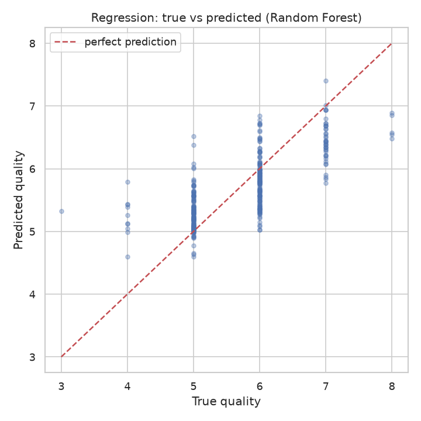
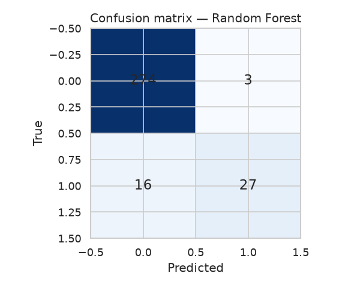
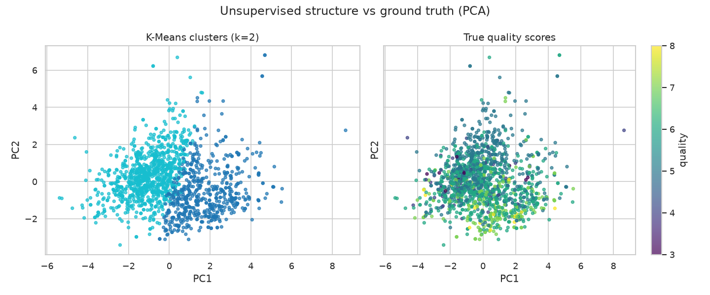

# ml-algorithms-showcase

Supervised and unsupervised machine learning, end to end, on one real dataset.

## The dataset

[Red wine quality](https://archive.ics.uci.edu/dataset/53/wine+quality)
(UCI Machine Learning Repository) — 1,599 Portuguese red wines described by
11 physicochemical measurements (acidity, sugar, pH, alcohol, …), each rated
with a sensory quality score from 3 to 8. A copy lives in
[`data/winequality-red.csv`](data/winequality-red.csv); see
[`data/README.md`](data/README.md) for the data dictionary.

## What's inside

| Task | Type | Algorithms | Question answered |
|------|------|-----------|-------------------|
| [Regression](experiments/01_regression.py) | supervised | Linear Regression, Ridge, Random Forest | Can we predict the exact quality score? |
| [Classification](experiments/02_classification.py) | supervised | Logistic Regression, SVM (RBF), Random Forest, k-NN | Can we tell a "good" wine (quality ≥ 7) from the rest? |
| [Clustering](experiments/03_clustering.py) | unsupervised | K-Means, DBSCAN (+ PCA visualization) | Do wines naturally group into quality-like clusters? |

Every experiment is a runnable script that prints a metrics table, saves
plots to `results/figures/`, and appends its scores to `results/metrics.json`
— so the whole study is reproducible with one command.

## Quickstart

```bash
python -m venv .venv && source .venv/bin/activate
pip install -r requirements.txt

# run everything
bash run_all.sh

# or run one experiment
python experiments/01_regression.py
python experiments/02_classification.py
python experiments/03_clustering.py

# run the test suite
pytest -v
```

## Results (on the full dataset)

### Regression — predicting the quality score



| Model | RMSE ↓ | MAE ↓ | R² ↑ |
|-------|--------|-------|------|
| Linear Regression | 0.62 | 0.50 | 0.40 |
| Ridge | 0.63 | 0.50 | 0.40 |
| Random Forest | 0.55 | 0.42 | 0.53 |

Tree ensembles clearly win — wine quality is a non-linear problem, and
alcohol, volatile acidity and sulphates dominate the feature importances.

### Classification — "good wine" vs the rest (quality ≥ 7)



| Model | Accuracy | F1 | ROC-AUC |
|-------|----------|----|---------|
| Logistic Regression | 0.89 | 0.48 | 0.88 |
| SVM (RBF) | 0.91 | 0.55 | 0.89 |
| Random Forest | 0.94 | 0.74 | 0.95 |
| k-NN | 0.89 | 0.48 | 0.85 |

The classes are imbalanced (~13% good wines), so F1 and ROC-AUC tell the
real story — Random Forest generalizes best.

### Clustering — do natural groups match quality?



| Method | Silhouette ↑ | Notes |
|--------|--------------|-------|
| K-Means (k=2, best of k=2–8) | 0.21 | clusters only weakly align with quality (avg. purity 0.46) |
| DBSCAN (eps=2.0, tuned) | 0.16 | finds a dense "typical wine" core plus outliers |

Unsupervised structure only partially recovers the quality labels — a good
reminder that clusters ≠ classes.

> Numbers above are from a reference run; re-running reproduces them
> (all randomness is seeded).

## Project structure

```
ml-algorithms-showcase/
├── data/
│   ├── winequality-red.csv   # dataset (UCI, semicolon-separated)
│   └── README.md             # data dictionary + source
├── src/
│   ├── data_loader.py        # load + train/test split
│   ├── features.py           # scaling, target engineering
│   └── evaluate.py           # shared metrics / plotting helpers
├── experiments/
│   ├── 01_regression.py
│   ├── 02_classification.py
│   └── 03_clustering.py
├── results/
│   ├── metrics.json          # generated scores
│   └── figures/              # generated plots
├── tests/
│   └── test_pipeline.py
├── requirements.txt
├── run_all.sh
└── LICENSE
```

## Techniques demonstrated

- **Supervised:** linear/ridge regression, random forests, logistic
  regression, support vector machines, k-nearest neighbors, stratified
  train/test splits, cross-validation, ROC curves, confusion matrices
- **Unsupervised:** K-means (elbow + silhouette model selection), DBSCAN
  (eps tuning), PCA for visualization, scaling discipline (fit on train only)
- **Engineering:** seeded reproducibility, a shared evaluation module so
  experiments stay comparable, pytest suite, one-command reproduction

## License

MIT — see [LICENSE](LICENSE). Dataset © UCI Machine Learning Repository
(see `data/README.md`).
